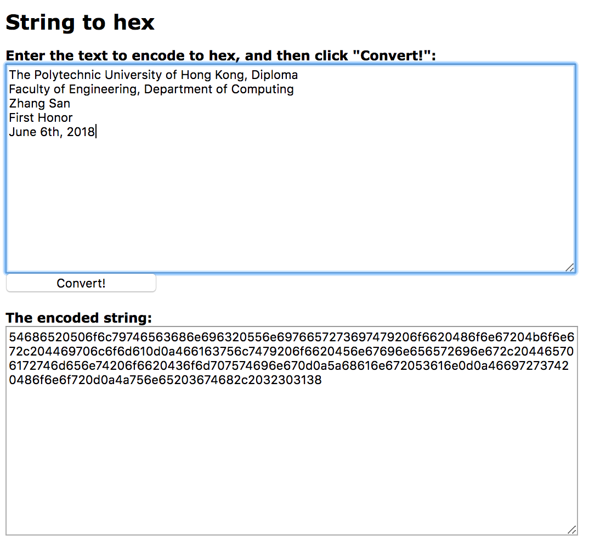
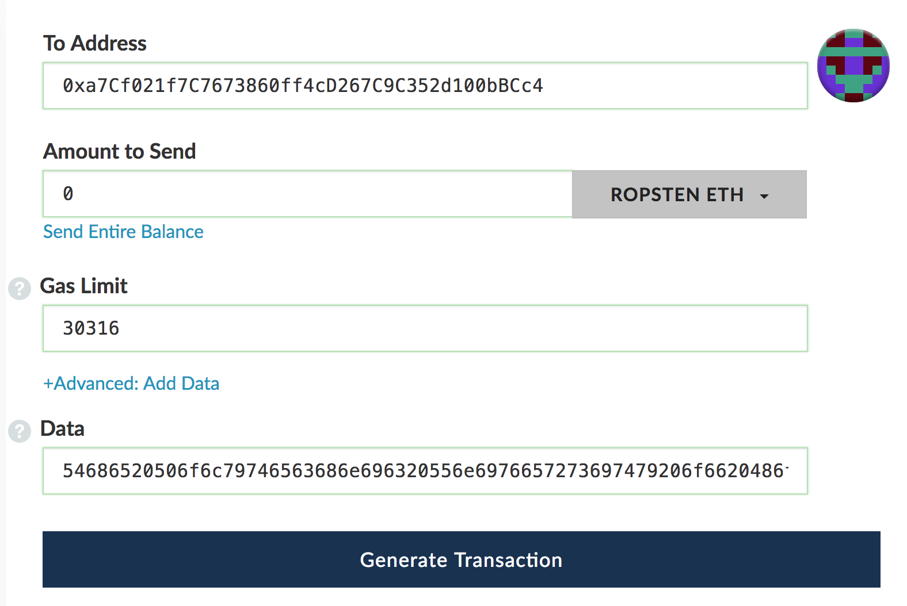

1.  Create a wallet on Myetherwallet or use hardware wallet for safer storage

2.  Get some ETH on your account

3.  Collect the ETH address of your students

4.  Send the certified message to the certified accounts (0 ETH sent, only transaction fee will be cost)
  
  
    4.1 [Unlock ETH account](https://www.myetherwallet.com/#send-transaction)
  
    4.2 [Convert certified message into hex form](http://string-functions.com/string-hex.aspx)
    
  
    4.3 Paste the hex message into "Input Data" field
    
  
    4.4 Confirm the transaction

5.  Post your ETH public address to your website for future checking

