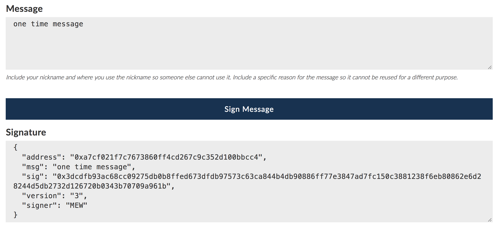

1.  Create a wallet on Myetherwallet or use hardware wallet for safer storage

2.  Inform diploma issuer of your ETH address

3.  Get the transaction ID containing the issuance message

4.  Upload this message within your CV for the initial checking

5.  Wait for validator prompting the signing message

6.  Sign the message within the limited time range to prove the ownership of this address

    1.1 [Input the one-time message](https://www.myetherwallet.com/signmsg.html) from validator
    1.2 Return the signature to validator for final checking
    
    

