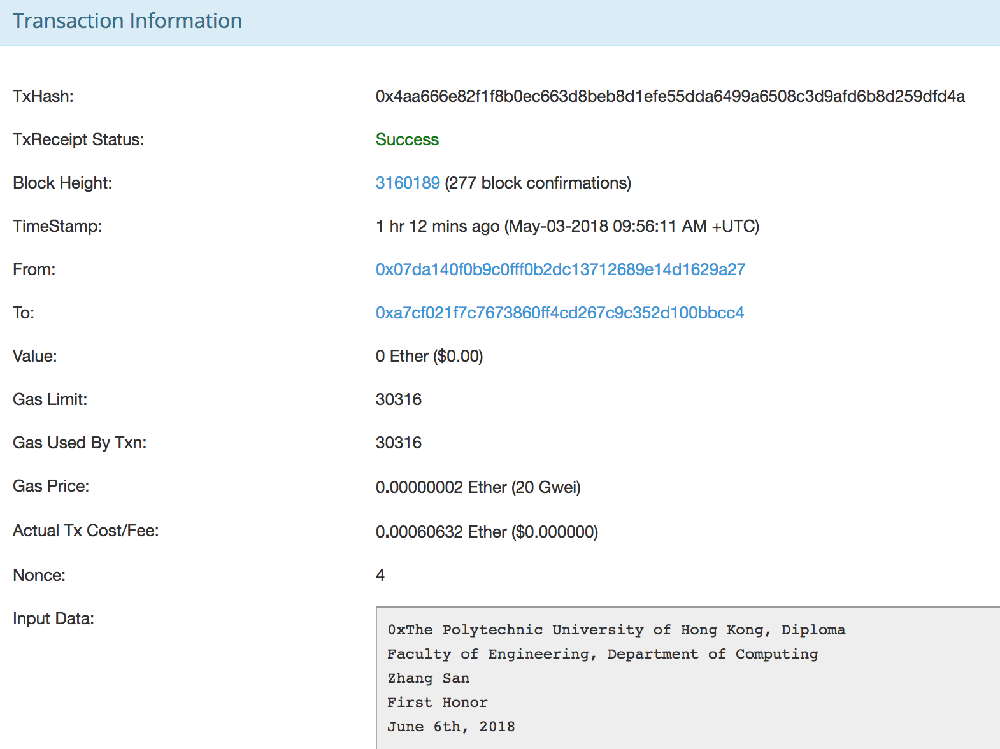
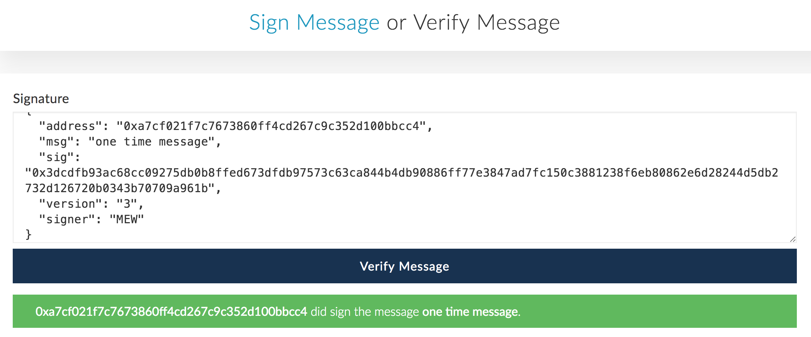

1.  Check the diploma issuer's offical website for correct ETH address

2.  Check the [transaction information](https://ropsten.etherscan.io/tx/0x4aa666e82f1f8b0ec663d8beb8d1efe55dda6499a6508c3d9afd6b8d259dfd4a) to see:

  
    2.1 whether the sender is the issuer's address
  
    2.2 whether the receiver is the job seeker's address
  
    2.2 whether transaction message is matched with the description provided by the job seekers
    
  
  
3.  Send one-time message to the job seeker for signature of signed message

4.  [Verify](https://www.myetherwallet.com/signmsg.html) if this signature indicates the ownership of the job seeker 
  

    

